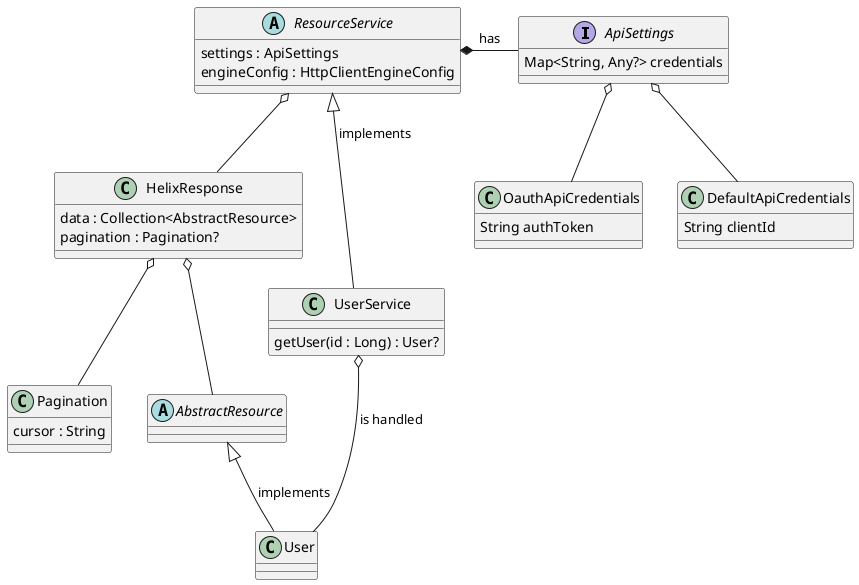
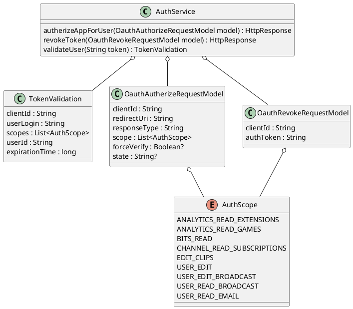

## 1. Class diagram for resource services

```plantuml
@startuml
interface ApiSettings {
    Map<String, Any?> credentials
}

class OauthApiCredentials {
    String authToken
}

class DefaultApiCredentials {
    String clientId
}

abstract class ResourceService {
    settings : ApiSettings
    engineConfig : HttpClientEngineConfig
}

class HelixResponse {
    data : Collection<AbstractResource>
    pagination : Pagination?
}

class Pagination {
    cursor : String
}

abstract class AbstractResource

class UserService {
    getUser(id : Long) : User?
}

class User

ResourceService *- ApiSettings : has

ResourceService <|-- UserService : implements

UserService o-- User : is handled

AbstractResource <|-- User : implements

ResourceService o-- HelixResponse

ApiSettings o-- OauthApiCredentials

ApiSettings o-- DefaultApiCredentials

HelixResponse o-- AbstractResource
HelixResponse o-- Pagination
@enduml
```

## 2. Authentication service class diagram

```plantuml
@startuml

class AuthService {
    autherizeAppForUser(OauthAuthorizeRequestModel model) : HttpResponse
    revokeToken(OauthRevokeRequestModel model) : HttpResponse
    validateUser(String token) : TokenValidation

}

class TokenValidation {
    clientId : String
    userLogin : String
    scopes : List<AuthScope>
    userId : String
    expirationTime : long
}

class OauthAutherizeRequestModel {
    clientId : String
    redirectUri : String
    responseType : String
    scope : List<AuthScope>
    forceVerify : Boolean?
    state : String?
}

class OauthRevokeRequestModel {
    clientId : String
    authToken : String
}

enum AuthScope {
    ANALYTICS_READ_EXTENSIONS
    ANALYTICS_READ_GAMES
    BITS_READ
    CHANNEL_READ_SUBSCRIPTIONS
    EDIT_CLIPS
    USER_EDIT
    USER_EDIT_BROADCAST
    USER_READ_BROADCAST
    USER_READ_EMAIL
}

AuthService o-- TokenValidation
AuthService o-- OauthAutherizeRequestModel
AuthService o-- OauthRevokeRequestModel

OauthAutherizeRequestModel o-- AuthScope
OauthRevokeRequestModel o-- AuthScope

@enduml
```