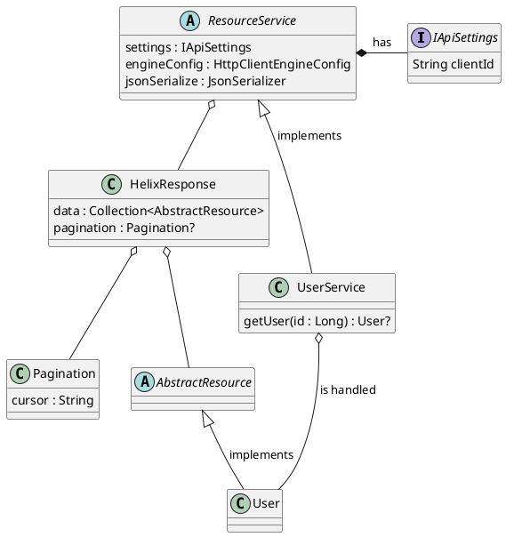

# Kotlin Twitch API Client

A modern Kotlin library for accessing the newest Twitch Helix API. 

## 1. Getting started

For now, endpoints that require an OAuth token are not supported. Only the ones that client id work.

In order to get a client id for your twitch extension follow [this guide](https://dev.twitch.tv/docs/api).

Example of performing a GET user request
```
val userService = UserService(DefaultApiSettings(), ApacheEngineConfig(), KotlinxSerializer())
    runBlocking {
        println(userService.getUser(44322889).toString())
    }
```

In this case, the client id has to be set in the `DefaultApiSettings` class (you can also write your own implementation of `IApiSettings`):

```
class DefaultApiSettings : IApiSettings {

    override val clientId: Pair<String, String> = Pair("Client-ID", "<insert client id here>")
}
```

## 2. Currently Supported Endpoints

* GET `helix/users?id=[user id]`

### 2.1 Class diagramm


    
## 3. Dependencies

### 1. Ktor client

- Built on top of the *Ktor* library
- Resons for choosing *Ktor* over *Spring Boot*:
    - More lightweight, less complexity
    - Customaziable, doesn't include all of the extra dependencies that are brought with Spring Boot

### 2. Kotlinx.serializaiton

- All JSON operations are done using the *Kotlinx Serialization* library
- Reasons for choosing *Kotlinx* over other libraries:
    - Made for Kotlin and not Java, makes use of some Kotlin only features (for example optionals)
    - Is relatively fast (see [this benchmark](https://github.com/wizzardo/json-benchmarks))
    - Even though it is currently pretty unstable, it will probably be the default Kotlin serialization library to use future language versions
