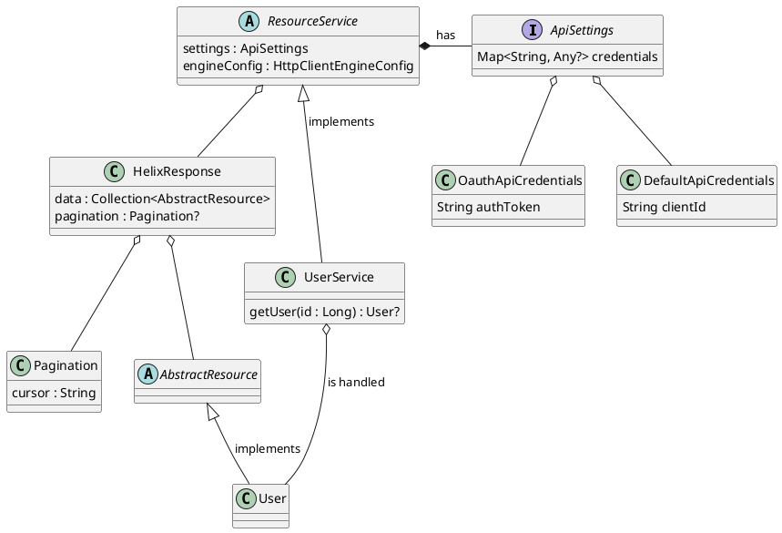
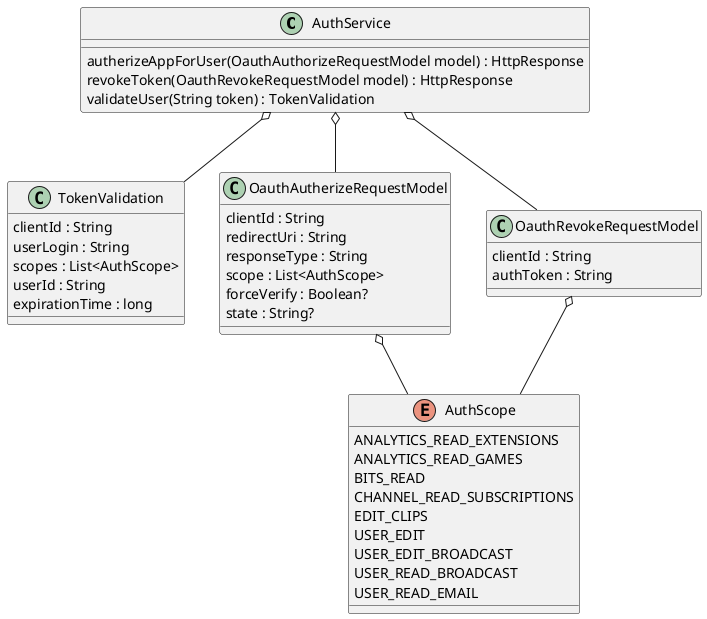

# Kotlin Twitch API Client

A modern Kotlin library for accessing the newest Twitch Helix API. 

## 1. Getting started

### 1.1 Using only a client ID (without OAuth)


In order to get a client id for your twitch extension follow [this guide](https://dev.twitch.tv/docs/api).

Example of performing a GET user request
```
val userService = UserService(
        DefaultApiSettings(
            Properties.store(DefaultApiCredentials("<your client id>"))
        ), ApacheEngineConfig()
    )
    runBlocking {
        println(userService.getUser("frozencure").resource.toString())
    }
```

In this case, the API credentials are converted to a `Map<String, Any?>` with the help of the `Properties.store()` method. The map is used in turn as the header for every HTTP request.

### 1.2 Using an OAuth token

This library currently supports only the *Implicit OAuth code flow*. It is advised to first go through the [Twitch API reference authentication section](https://dev.twitch.tv/docs/authentication) for a more in depth understanding.

#### 1.2.1 Getting an OAuth token for an user

The first step in the OAuth flow is to register the Twitch user with your app. This means that the user will have to authorize your app to access his private Twitch data or perform requests on his behalf.

Firstly, you will have to create an instance of the `OauthAuthorizeRequestModel` class, which has the following fields:

* **clientId** -> your app's client ID
* **redirectURI** -> the URI where the user will be redirected after authorization, you can find it in the Twitch Developer console. It has to be the same as the one mentioned in your Twitch app settings, otherwise the authorization will not work
* **responseType** -> for the implicit OAuth code flow the only available option is "token"
* **scope** -> the scopes that the user will be asked to authorize
* **forceVerify** -> when true, (re)authorization will be required for every single request (optional)
* **state** -> variable used to mitigate CSFR attacks (optional)

Here is an example of a valid `OauthAuthorizeRequestModel` instance:
```
val requestModel = OauthAuthorizeRequestModel(
    "nsfsgvu4k8h80iq0r7ya4zx1fasfa", // client-id
    "http://localhost", // redirect-URI
    "token", // response type
    AuthScope.values().toList()// scopes
)
```

Next, we will use the `AuthService` to retrieve URL where the user will be directed to login. This can be done in the following way:
```
val authService = AuthService(ApacheEngineConfig())
runBlocking {
        val response = authService.authorizeAppForUser(requestModel)
        println(response)
    }
```

The code snippet from above will return the following response with URL:
```
https://www.twitch.tv/login?client_id=<your client id>&redirect_params=<scopes + other parameters>
```

Next, the user will authorize the app by accepting the requested permissions and loging in to Twitch. After the login completes successfully, he will be redirected to the `redirectURI` mentioned above:
```
http://localhost/#access_token=1abcgtpzp1iwrsiiqlr0tvfvkiawy3&scope=<accepted scopes>&token_type=bearer
```

Inside the redirect URL you will be able to find the OAuth user token.

From now on, you will be able to use this token to make request on the user behalf. For example:
```
val userService = UserService(
        DefaultApiSettings(
            Properties.store(OautApiCredentials("<your usert token>"))
        ), ApacheEngineConfig()
    )
    runBlocking {
        println(userService.getUser("frozencure").resource.toString())
    }
```

### 1.2.2 OAuth token validation

When using OAuth tokens to perform requests, it is advised to periodically validate the token, to make sure that the user didn't revoke access of the app to his data. The Twitch team mentions that failure of doing this can lead revoking the developer API key or throttling of the application.

The `AuthService` also supports validation:
```
val authService = AuthService(ApacheEngineConfig())
    runBlocking {
        val tokenValidationModel = authService.validateUser("<the auth token>")
        println(tokenValidationModel)
    }
```
This will retrieve the following `TokenValidation` instance:

```
TokenValidation(
    clientId=nyufzabdsf8h80iq0r7ya4zx1fsas7d, userLogin=frozencure, 
    scopes=[ANALYTICS_READ_EXTENSIONS, ANALYTICS_READ_GAMES, BITS_READ, CHANNEL_READ_SUBSCRIPTIONS, ...], userId=83035654, 
    expirationTime=5662299
)
```

### 1.2.3 Revoking a token

To clean up previously obtained access tokens, the `AuthService` offers support for programatically revoking the OAuth tokens:
```
    val authService = AuthService(ApacheEngineConfig())
    runBlocking {
        val response = authService.revokeToken(
            OauthRevokeRequestModel("<client-id>",
            "<auth-token>")
        )
        println(response)
    }
```


## 2. Currently Supported Endpoints

* Users
    * GET users :heavy_check_mark:
    * GET followers :heavy_check_mark:
    * PUT update user :heavy_check_mark:
    * GET user extensions :heavy_check_mark:
    * GET user active extensions :x:
    * PUT update user extensions :x:
* Videos
    * GET videos :heavy_check_mark:
* Clips
    * GET clips :heavy_check_mark:
    * POST create clip :heavy_check_mark:
* Webhooks
    * GET subscriptions :heavy_check_mark:
* Games
    * GET games :heavy_check_mark:
    * GET top games :heavy_check_mark:
* Analytics
    * GET extension analytics :x:
    * GET game analytics :x:
* Bits
    * GET bits leaderboard :x:
* Extensions
    * GET extension transactions :x:
* Entitlements
    * POST Create entitlement grants upload URL :x:
    * GET code status :x:
    * POST redeem code :x:
* Moderation
    * POST check auto-mod status :x:
    * GET banned events :x:
    * GET banned users :x:
    * GET moderators :x:
    * GET moderator events :x:
* Streams
    * POST create stream marker :x:
    * GET streams :x:
    * GET stream markers :x:
    * GET stream metadata :x:
* Subscriptions
    * GET broadcaster subscriptions :heavy_check_mark:
* Stream tags
    * GET all stream tags :x:
    * GET stream tags :x:
    * PUT replace stream tags :x:


### 2.1 Class diagram for resource services



### 2.3 Authentication service class diagram


    
## 3. Dependencies

### 1. Ktor client

- Built on top of the *Ktor* library
- Reasons for choosing *Ktor* over *Spring Boot*:
    - More lightweight, less complexity
    - Customizable, doesn't include all of the extra dependencies that are brought with Spring Boot

### 2. Kotlinx.serializaiton

- All JSON operations are done using the *Kotlinx Serialization* library
- Reasons for choosing *Kotlinx* over other libraries:
    - Made for Kotlin and not Java, makes use of some Kotlin only features (for example optionals)
    - Is relatively fast (see [this benchmark](https://github.com/wizzardo/json-benchmarks))
    - Even though it is currently pretty unstable, it will probably be the default Kotlin serialization library to use future language versions
